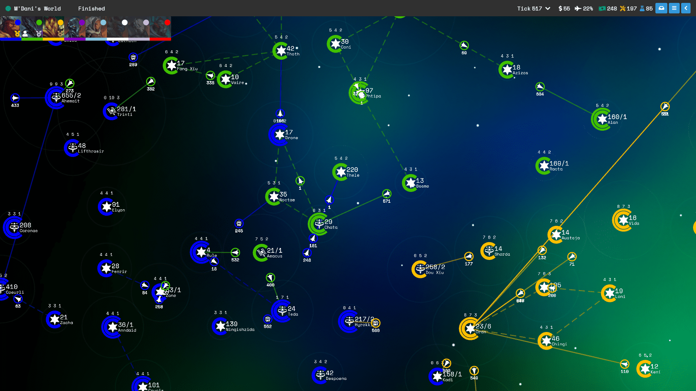

# Solaris

Solaris is a slow-burn browser game heavily inspired by [Neptune's Pride](https://np.ironhelmet.com) and [Subterfuge](http://subterfuge-game.com/).

- Build economic, industrial and scientific infrastructure to improve your empire.
- Build carriers to travel to new stars or to fight your enemies.
- Research new technologies to gain an edge over your opponents.
- Hire specialists which grant special abilities to stars and carriers like increased weapons and speed.
- Set up trade with your allies to get ahead of the curve.
- Play games with up to 64 players at a time.
- Participate in group chats with your allies to discuss strategy.
- Fight other players and capture stars to win the game.
- Games last around 2-3 weeks, and you don't need to commit a lot of time to play!
- Play on any device that has a web browser.
- Its completely free!

Visit [solaris.games](https://solaris.games) to play now!

### Server
The server uses the following tech:
- [Node.js](https://nodejs.org/en/)
- [Express](https://expressjs.com/)
- [MongoDB](https://www.mongodb.com/)
    - [Mongoose](https://mongoosejs.com/)

### Client
The client uses the following tech:
- [Vue.js](https://vuejs.org/)
- [PixiJS](https://www.pixijs.com/)

## Development Environment Setup
1. Install the prerequisites.
    - [Node.js](https://nodejs.org/en/) v22
    - [MongoDB](https://www.mongodb.com/) v7.0
2. Clone the repository.
3. Checkout `master`.
4. `npm install` in the root directory
5. `npm run build` in the root directory (do not skip this even when running the dev server)
6. Create a `.env` file in `server/` (See `.env.example`).
7. Create a `.env` file in `client/` (See `.env.example`).
8. `npm run start-jobs:dev` in `server/` to start the automated jobs and setup new games.
9. `npm run start-api:dev` in `server/` to start the API.
10. `npm run dev` in `client/` to start the client application.
11. Browse to the site locally (default [http://localhost:8080](http://localhost:8080)).

*Note: Development work is to be based on the `dev` branch, for a new feature or bug fix, create a branch from `dev`.*

### Database Migrations
To keep up to date with the latest changes, you must run the database migations to ensure that your database is compatible.

1. `npm run start-db-migrate:dev` in `server/` to update your local database to the latest schema.

*Note: This script assumes that you have a `solaris` database on your system. If not, perform the **Development Environment Setup** above first.*

### Development Environment Automation (Optional)
To automate the development environment, it is recommended to use [PM2](https://pm2.keymetrics.io/).

1. Install `pm2`.
2. `pm2 start pm2.config.js` to register `pm2` apps.

The above script will create the server jobs, API and client applications, watch for changes and restart those applications when necessary. 

You can make use of debugger attach for VS Code defined in the `.vscode/launch.json` configuration file to easily attach the debugger to running apps.

Once configured, you can browse to the site locally (default [http://localhost:8080](http://localhost:8080)) as using the normal way detailed in the section above and any changes you make will automatically restart the applications.

## Run with docker

A docker compose config for development use can be found in `docker-compose.yml`. These images are **not** suitable for production usage.
The `docker/prod/` directory contains definitions for prod images, but no docker-compose is provided, it needs to be adapted from the dev version. 
The images can also possibly be found in the GitHub Registry but there is no guarantee that they are up-to-date.

## Contributing
See [here](CONTRIBUTING.md).

## License
See [here](LICENSE).
