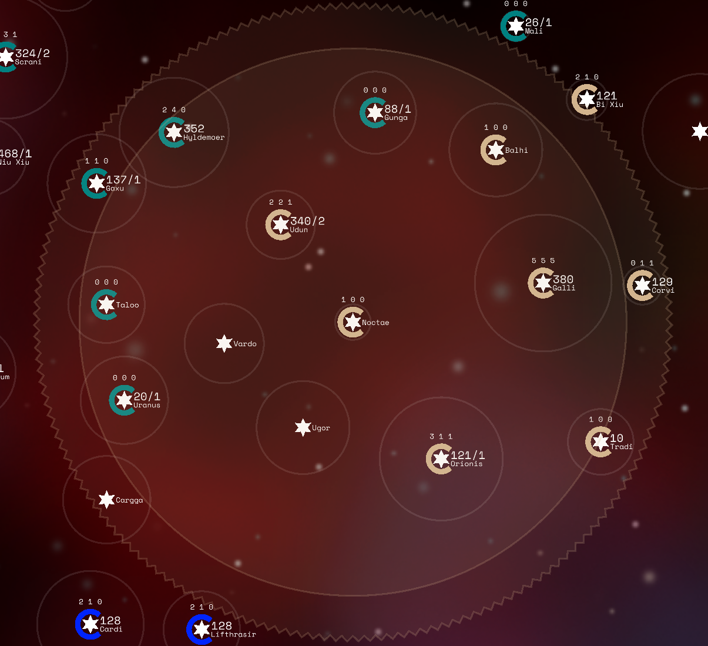

# The Solaris Wiki

## Introduction

Solaris is a slow paced browser game based on diplomacy, strategy and intrigue.
To win the game, you must capture stars.

You will not be alone, other players will also be trying to achieve the same
goal. You must build diplomatic relations with other players to create alliances,
trade agreements and possibly even subterfuge to backstab your allies and claim
victory.

The galaxy contains stars that can be upgraded and will build ships for carriers
that will traverse across the galaxy in order to capture unclaimed stars or
fight other players to capture theirs.

## Diplomacy

Diplomacy plays a huge role in Solaris, the key to victory is not only galactic
conquest, but also building relations with allies. You may first want to
establish an alliance early on in the game to gain an advantage.

You should build trade agreements with other players, there will almost
certainly be other players and alliances who will have trade agreements and it
is important to keep up with these players' technology levels otherwise you will
be at a disadvantage.

It may prove to be useful to become the sole player who has a large technology
lead of a single technology. For example if you have the highest Weapons
technology then other players will want to trade with you and may want to stay
friendly with you.

Be aware that other players may be plotting to destroy your empire, especially
if you have a lead or are relatively weak. Remember to keep communications open
and your borders protected from unwanted aggression.

## Trade

Trade is an integral part of diplomacy. When you select a player in a game there
will be an option to trade either technology or credits. Trading technology with
another player will cost a certain amount of credits based on the game's
settings. In a standard game the transfer cost of technology is $15 per tech
level, so trading a level 2 technology would cost $30 and a level 3 technology
would cost $45.

Alongside technology you can also send credits to another player. To send
credits to a player simply input how much you want to give to the player in the
text box at the bottom.

To keep track of trade there is a ledger. It details how much a player owes.
Players have the option to repay their debt or the creditor can forgive all
debt.

Depending on game settings a player may have to be in scanning distance with
another player in order to trade with them.

## Galaxy

The galaxy map will display the following:

 - Stars
 - Carriers
 - Warp Gates
 - Specialists

### Stars

Stars are displayed as star shaped icons with a circular halo denoating which
player the star belongs to by colour. When zoomed in the star will display
garrison and how many carriers are orbiting the star (if any) followed by the
star's name. Above the star there will be 3 numbers, these represent the star's
Economy, Industry and Science infrastructure respectively.
Click on the star to view it in detail.

If star has a warp gate then it will be displayed with an additional halo.

### Carriers

Carriers are displayed as small ship icons with a circular coloured halo, much
like stars. The number of ships that a carrier has will be displayed when zoomed
in. Click on the carrier to view it in detail.

Carriers that have waypoints will have a line drawn to their destination.
If those waypoints are looped then the line will be slightly thinner.

### Specialists

If a star or carrier has a specialist, the matching specialist icon will be
displayed instead of the standard star/carrier icon. To view the specialist in
detail, click on the star/carrier and scroll to the "Specialist" section.
Specialists can provide any number of modifiers to a star or carrier's
statistics, and are fundamental to a strategically successful game.

### Galaxy Territories

If you zoom far out the territories held by players will be visible.
This gives you a good indication of where empires are located, and you will be
able to identify strong areas and weak points that are cut off from the rest of
a player's stars. There are two different styles of territory appearance,
which can be accessed from the in-game options menu.

## Stars

Stars on the map display the following details:

 - The star name
 - The star owning player denoted by its colour
 - The star's total garrison
 - The star's infrastructure (Economy, Industry, Science)
 - Whether the star has a warp gate

Click on a star to view the star statistics in detail. This screen displays all
of the information related to the star. In order displayed in the image, is the
star name, a button for centering on the star, a button to close the menu, the
owner of the star, the star's natural/terraformed resources, the star's economy,
industry, and science levels, how many ships are stationed at the star, the
specialist that is stationed at the star, and how many ships the star
manufactures every tick. Below that are the buttons to purchase more economy,
industry, and science, as well as a button for creating a carrier at the star
and a button for purchasing a warpgate at the star.

A star's natural resources determines how many credits it will cost to build
infrastructure. The higher the natural resources, the cheaper it costs to
upgrade.
Stars with natural resources tend to be highly saught after.

The Terraforming technology improves the star's natural resources and makes
building infrastructure cheaper.

 - Upgrade star infrastructure improve the star's cash yield, increase ship
   production and speed up research.
 - Build a Carrier to transport ships through hyperspace.
 - Build a Warp Gate to accelerate carrier movement.
 - Upgrade the Star by hiring a Specialist which grants special abilities.

**Warp Gates** will improve the speed by times 3 of what Carriers typically
travel between star. A warp gate must be built at the departure star and the
destination star in order for a Carrier to receive the speed boost. The warp
gate speed boost also multiplies by 3 even if the traveling carrier has a speed
boost from a specialist. Therefore, if the carrier has a times 2 speed boost
from a specialist, then when that carrier is traveling between two warp gates it
will travel at times 6 speed.

You may choose to **abandon a star**, in which case all Carriers and Ships at
the star will be destroyed and all infrastructure will remain intact, including
a warp gate if present.
When abandoned the warp gate will become inactive until the star is claimed
again, so it will not grant a speed boost to incoming Carriers.

## Infrastructure

There are 3 types of infrastructure that can be built at stars:

 - **Economy** - Increases income at production, each point of Economy earns 10
   credits on the production tick.
 - **Industry** - Increases ship production rate.
 - **Science** - Increases research speed. Each point of Science will generate
   one research point per tick for the chosen current technology that is being
   researched.

When you select a star its Hyperspace Range and Scanning Range will become
visible. Hyperspace Range is displayed as a ridged ring centered on the star and
the Scanning Range is displayed as a solid circle around the star.

## Carriers

Carriers are used to transport Ships through hyperspace to reach other Stars.
They can only be built at Stars and must hold a minimum of 1 Ship.

 - Build a Carrier at a star.
 - Plot the waypoints that the Carrier will follow.
 - Transfer Ships between Carriers and Stars.
 - Capture neutral or enemy Stars by sending a Carrier to one.
 - Send a Carrier to intercept an incoming enemy Carrier.
 - Purchase a specialist on a carrier to grant special abilities.

Carriers are displayed as small ship icons with a coloured shape, matching its
owner's stars.
The number of ships that a carrier has is displayed when you zoom in on it.
Click on the carrier to view its statistics in detail.

Carriers that have waypoints will have a line drawn to their destination.
To set a carrier's waypoints, (where it will travel to) click on the + symbol in
the carrier's menu. You can then click on stars to add them to the carrier's
queue. A carrier can have any amount of scheduled waypoints. If those waypoints
are looped then the waypoint line will appear fainter. You can loop a carrier's
waypoints at any point by clicking the "loop" button in the carrier's menu.
The carrier will then endlessly follow its waypoints, traveling from from the
last waypoint of its que to the first one when it reaches the end of its path.
To loop a carrier, the two ends of its waypoint que must be within valid range
of each other.

By default a Carrier will transfer **all** garrisoned Ships at the Star it was
built at, this can be configured in the menu settings.

By default, Carrier waypoints will **Collect All Ships** when landing at a
destination. To change that, after setting a carrier's waypoints click save and
edit to change what actions the carrier will perform at its next waypoint.

Carriers can also be gifted to other players. When a gifted carrier arrives at
its destination the player who owns the star will gain control of the carrier
and its ships. Note that if a carrier has a specialist, that specialist will be
retired.

## Combat

Combat occurs when a Carrier arrives at an enemy Star or when a Carrier
intercepts an enemy Carrier in hyperspace. The combat summary can be viewed in
the event log.

When 2 opposing Carriers arrive at a Star on the same tick, the Carrier that
travelled the least distance in the current tick will arrive at the Star first
and receive the Defender Bonus (if enabled).

Starting with the defender, each player takes it in turns to deal damage to the
opposing player. Damage dealt per turn is equal to the effective weapons level,
factoring in weapons technology and specialist abilities.
Damage is dealt roughly equally to all Carriers and the Star per turn.

If multiple opposing Players are in combat at the same time, they will be split
into Attackers and Defenders. Where the defender is the player who owns the star
and the attackers are all other players.
Combat is repeated until there is one player remaining.

When a Star is captured, all of its Economy is destroyed and the winner is
awarded 10 credits per point of Economy. Industry, Science, Warp Gates and
Star Specialists are undamaged and are captured by the winning player.

Combat can also occur between two carriers. When two carriers from different
players intercept each other they will engage in carrier to carrier combat.
In carrier to carrier combat there is no defender bonus.

The combat calculator is a useful tool to predict the outcome of combat.
Simply input the defender and attacker's weapons level and number of ships and
it will present the outcome.

## Science & Technology

Science infrastructure built at Stars contribute to the overall research amount
per tick for the chosen technology that is being researched.
More Science infrastructure increases the speed of which new technology is
researched.

Open the Research screen to view the current research and set the next research.
The types of technologies are as follows:

 - **Scanning** - Improves the visible area star a star can see.
   The higher your scanning, the further you can see.
 - **Hyperspace Range** - Improves the distance a carrier can travel in between
   each waypoint.
 - **Terraforming** - Improves the natural resources at Stars to make
   infrastructure upgrades cheaper.
 - **Experimentation** - Grants a 50 bonus points per level to a random
   technology each production.
 - **Weapons** - Improves the amount of enemy carriers each friendly carrier
   destroys in combat. Each carrier destroys enemy carriers exactly equal to the
   local weapons level.
 - **Banking** - Earns 75 extra credits every production. If experimental
   banking is enabled in game settings, you get additional extra credits based
   from your economy level.
 - **Manufacturing** - Increases ship production rate on all stars. The exact
   formula is a star produces `(X*(Y+5))/T` ships per tick, where `X` is the
   star's industry, `Y` is the star's manufacturing level, and `T` is the number
   of ticks in every production cycle.
 - **Specialists** - Increases the number of specialist tokens awarded at the
   end of a galactic cycle, these are used to hire specialists.

## Turn Based Games

Turn based games play differently to real time games.
The game does not run in real time, however runs in tick intervals.

When all players are ready, a given number of ticks (based on game settings)
will happen all at once. This means that games can be played much much faster
than real time games or allow players who do not have enough time to monitor
real time games to play competitively.

Like in real time games, turn based games have an auto-resign function.
If a player misses a number of consecutive turns equal to the game’s settings,
or doesn’t do anything on the first turn, that player will be automatically
resigned.

## Achievements

Your game statistics are tracked whilst playing Solaris and you can view a
breakdown of your achievements on the Achievements page.
You can also view other player’s achievements by selecting their name on the
leaderboard.

## Game Tick Events

 The game runs in ticks, during a tick the following events happen in order:

 1.  Carriers move and carrier-to-carrier combat is resolved.
 2.  Carrier-to-star combat is resolved.
 3.  Carrier drop actions are performed.
 4.  Ships are built at stars.
 5.  Carrier collect actions are performed.
 6.  Carrier garrison actions are performed.
 7.  If at the end of a galactic cycle:
 7a. Players receive credits from economy and banking.
 7b. Experimentations are performed.
 7c. Carrier upkeep is deducted.
 8.  Game checks for afk and defeated players.
 9.  Game checks for a winner.
 10. AI actions are performed.
 11. Research is performed.
 12. Intel is logged.

