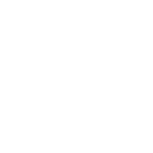

# Specialists

If a star or carrier has a specialist, the matching specialist icon will be displayed instead of the standard star/carrier icon. 

Specialists can provide any number of modifiers to a star or carrier's statistics, and are fundamental to a strategically successful game.

## Star Specialists

| Specialist Name | Effect | Cost |
| --------------- | ------- | ---- |
|  **Orbital Array**        | Grants +1 Scanning Range to the Star. | 1
|  **Space Dock**           | Grants +2 Manufacturing, -1 Terraforming to the Star. | 2
|  **Atmosphere Processor** | Grants +3 Terraforming, -1 Scanning to the Star. | 2
|  **Orbital Cannon**       | Grants +1 Weapons to the Star. | 2
|  **Warp Scrambler**       | Locks the Warp Gate at the Star to prevent enemy players from using it. Weapons -1. | 3
|  **Scrambler**            | Prevents other players from seeing how many ships are garrisoned at the Star. | 3
|  **Demolition Controller**           | If the Star is captured, all infrastructure is destroyed. | 3
|  **War Machine**          | Deducts 1 from the Star's natural resources every tick, +5 Manufacturing, +5 Weapons. When the star reaches 0 natural resources, the star dies and the specialist retires. **`This specialist cannot be replaced.`** |  5
|  **Research Station**     | The Star's Science infrastructure contributes x2 to research. -3 Terraforming, -3 Weapons, +1 Scanning. | 5
|  **World Builder**        | Adds 1 to the Star's natural resources every tick, -3 Scanning, -5 Weapons. | 10
|  **Trade Port**           | The Star's Economy infrastructure contributes x2 to economy production. -5 Terraforming, -3 Weapons, +1 Scanning. | 10 
|  **Financial Analyst**     | The star produces 2 credits per tick for each point of science on the star. | 10
 
## Carrier Specialists

| Specialist Name | Effect | Cost |
| --------------- | ------- | ---- |
|  **Pathfinder**      | Grants +1 Hyperspace Range to the Carrier. | 1
|  **Lieutenant**      | Grants +1 Weapons, -1 Hyperspace Range to the carrier. | 2
|  **Admiral**         | Grants x1.5 Speed, -1 Weapons, -2 Hyperspace Range to the carrier. | 3
|  **Colonel**         | Grants +2 Weapons, -1 Hyperspace Range, x0.75 Speed to the carrier. | 3
|  **Explorer**        | Grants +3 Hyperspace Range, x1.5 Speed, -3 Weapons to the carrier. | 3
|  **Scrambler**       | Prevents other players from seeing how many ships the carrier has. | 3
|  **Infiltrator**     | When participating in combat, the enemies fight with -1 Weapons. | 3
|  **Stellar Bomb**    | Reignites a dead star with 25 Natural Resources, the Stellar Bomb will be destroyed but the carrier will survive. x0.5 Speed. | 3
|  **General**         | Grants +3 Weapons, -1 Hyperspace Range, x0.5 Speed to the carrier. | 5
|  **Smuggler**        | Grants x2 Speed, -1 Hyperspace Range, -1 Weapons to the carrier. | 5
|  **Warp Stabilizer** | Warp Scramblers do not affect the carrier. | 5
|  **Raider**          | Carrier travels at x2 Speed, -2 Weapons. The carrier is awarded x2 star capture rewards for destroying infrastructure. | 5
|  **Pirate**          | Grants +3 Weapons in carrier-to-carrier combat, -2 Weapons in carrier-to-star combat and x1.5 Speed. | 5
|  **Marauder**        | The carrier does not participate in carrier-to-carrier combat. x1.5 Speed, -2 Hyperspace Range, -1 Weapons. | 5
|  **Destroyer**       | Grants +5 Weapons, -3 Hyperspace Range, x0.5 Speed to the carrier. | 10
|  **Coward**          | The carrier does not participate in carrier-to-carrier combat. x2 Speed. | 10