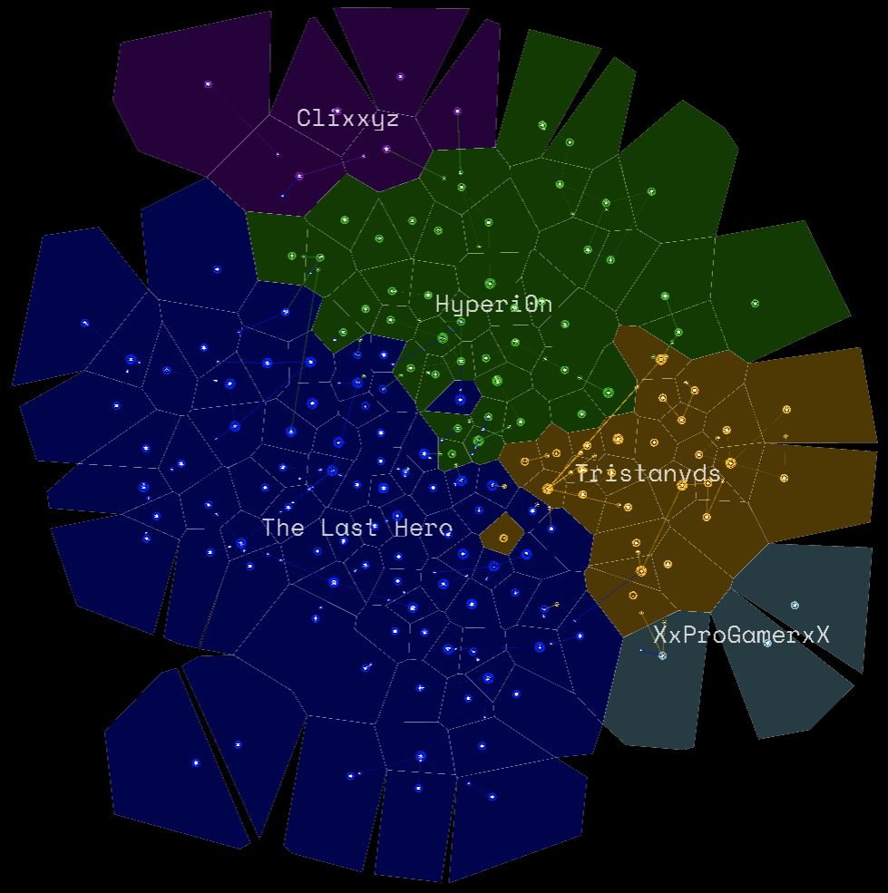

# Galaxy Territories

If you zoom far out the territories held by players will be visible. This gives you a good indication of where empires are located, and you will be able to identify strong areas and weak points that are cut off from the rest of a player's stars. There are two different styles of territory appearance, which can be accessed from the in-game options menu.

*Note: If you have a trackpad, use the two-finger zoom gesture to zoom in and out on the map, the pinch zoom gesture will zoom the UI.*
